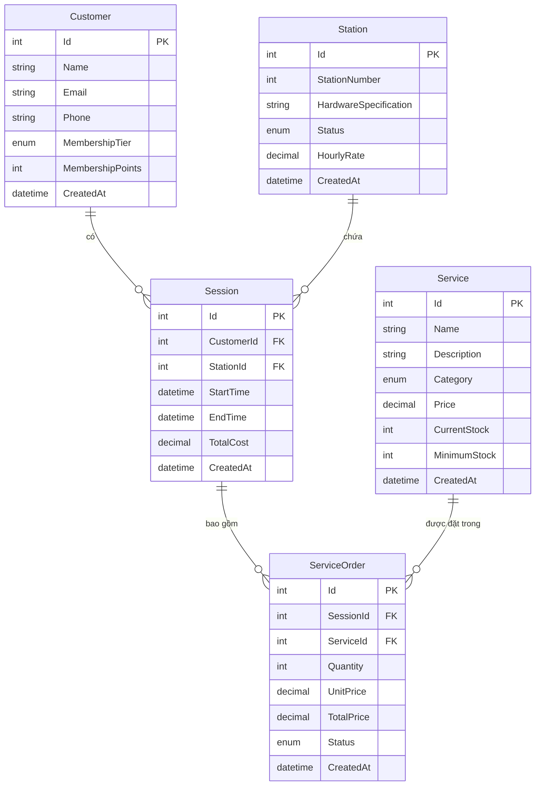

# Tài Liệu Cấu Trúc Cơ Sở Dữ Liệu

## Sơ Đồ Quan Hệ Thực Thể

## Chi Tiết Bảng

### Khách Hàng (Customer)
- Mục đích chính: Lưu trữ thông tin khách hàng và theo dõi trạng thái thành viên
- Các trường quan trọng:
  - `Id`: Khóa chính tự động tăng
  - `MembershipTier`: Enum (Thường, Bạc, Vàng)
  - `MembershipPoints`: Điểm tích lũy qua sử dụng
- Quan hệ:
  - Một khách hàng có thể có nhiều phiên (1:N)

### Máy Trạm (Station)
- Mục đích chính: Quản lý các máy chơi game và tình trạng sẵn sàng
- Các trường quan trọng:
  - `Id`: Khóa chính tự động tăng
  - `Status`: Enum (Trống, Đang sử dụng, Bảo trì)
  - `HourlyRate`: Giá tiền theo giờ sử dụng
- Quan hệ:
  - Một máy có thể chứa nhiều phiên (1:N)

### Phiên (Session)
- Mục đích chính: Theo dõi việc sử dụng máy của khách hàng
- Các trường quan trọng:
  - `Id`: Khóa chính tự động tăng
  - `CustomerId`: Khóa ngoại tới Khách hàng
  - `StationId`: Khóa ngoại tới Máy trạm
  - `TotalCost`: Tính dựa trên thời gian và dịch vụ
- Quan hệ:
  - Thuộc về một khách hàng (N:1)
  - Sử dụng một máy (N:1)
  - Có thể có nhiều đơn hàng dịch vụ (1:N)

### Dịch Vụ (Service)
- Mục đích chính: Quản lý tồn kho các dịch vụ bổ sung
- Các trường quan trọng:
  - `Id`: Khóa chính tự động tăng
  - `Category`: Enum (Thức ăn, Đồ uống, Thiết bị)
  - `CurrentStock`: Mức tồn kho hiện tại
  - `MinimumStock`: Ngưỡng cảnh báo tồn kho
- Quan hệ:
  - Có thể được đặt trong nhiều đơn hàng dịch vụ (1:N)

### Đơn Hàng Dịch Vụ (ServiceOrder)
- Mục đích chính: Theo dõi dịch vụ được đặt trong phiên
- Các trường quan trọng:
  - `Id`: Khóa chính tự động tăng
  - `SessionId`: Khóa ngoại tới Phiên
  - `ServiceId`: Khóa ngoại tới Dịch vụ
  - `Status`: Enum (Đang chờ, Hoàn thành, Đã hủy)
- Quan hệ:
  - Thuộc về một phiên (N:1)
  - Tham chiếu một dịch vụ (N:1)

## Chiến Lược Đánh Index

1. Khóa Chính
   - Tất cả trường `Id` tự động tăng và được đánh index

2. Khóa Ngoại
   - `CustomerId` trong bảng Sessions
   - `StationId` trong bảng Sessions
   - `SessionId` trong bảng ServiceOrders
   - `ServiceId` trong bảng ServiceOrders

3. Index Hiệu Năng
   - `StationNumber` trong bảng Stations
   - `StartTime` trong bảng Sessions
   - `CreatedAt` trong tất cả các bảng

## Ràng Buộc

1. Khách Hàng
   - Email phải duy nhất
   - Tên không được null hoặc rỗng
   - MembershipPoints không được âm

2. Máy Trạm
   - StationNumber phải duy nhất
   - HourlyRate phải dương

3. Phiên
   - EndTime phải sau StartTime
   - TotalCost phải không âm

4. Dịch Vụ
   - Name phải duy nhất
   - Price phải dương
   - CurrentStock và MinimumStock phải không âm

5. Đơn Hàng Dịch Vụ
   - Quantity phải dương
   - TotalPrice phải không âm

## Khởi Tạo Dữ Liệu

Ứng dụng bao gồm dữ liệu khởi tạo ban đầu để kiểm thử và demo:
- 3 khách hàng mẫu với các hạng thành viên khác nhau
- 3 máy chơi game với thông số khác nhau
- 3 dịch vụ mẫu thuộc các loại khác nhau